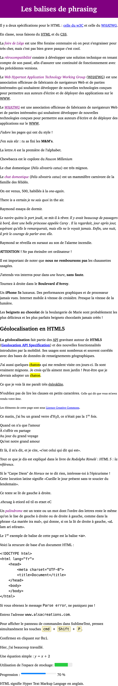

# HTML "phrasing"

> HTML exercise about phrasing & text tags

* * *

**HTML "Phrasing"** is an educational project, which will be used for `HTML`/`CSS` courses.

**Note:** the school where the course is given, the [HEPL](http://www.provincedeliege.be/hauteecole) from Liège, Belgium, is a french-speaking school. From this point, the instruction will be in french. Sorry.

* * *

## Un petit aperçu des balises de formatage de texte

Dans le document `index.html` joint à l'énoncé, nous allons découvrir toute une série de balises.

Une fois n'est pas coutume, les instructions de l'exercice se trouvent à l'intérieur du fichier [index.html](./index.html).

Voici un rendu du résultat final à obtenir.

Bon travail.
